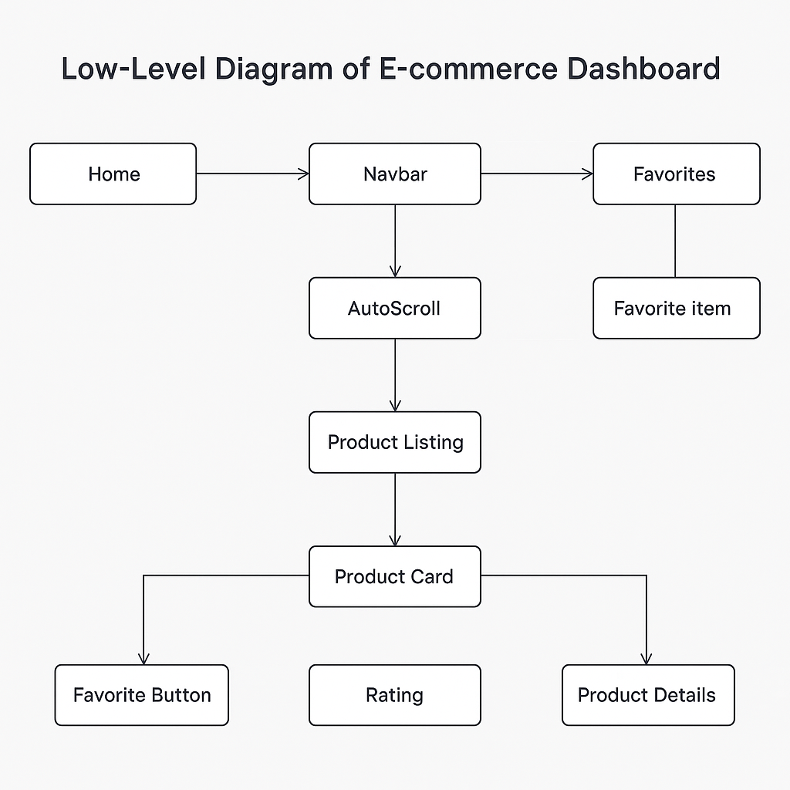

# 🛍️ Product Dashboard – Frontend Developer Assignment

A modern, responsive, and accessible product dashboard built using **React**, **Redux Toolkit**, and **Tailwind CSS**, with full integration of product listings, filtering, sorting, favorites, and testing suites.

> This project was created as part of a frontend hiring assignment. It demonstrates clean architecture, state management with Redux Toolkit, asynchronous API integration, responsive UI/UX, and test coverage.

---

## ✨ Features

- 🔍 **Search & Filter** products by title, category, and price
- 💖 **Favorite Products** – toggle and persist in Redux state
- 📦 **Product Detail Page** with rich information
- 🔁 **Auto-scrolling Trending Products** carousel
- ✅ **Unit and Integration Tests** using Vitest/Jest + Testing Library
- ⚡ **Debounced search input** for optimized performance
- 🌀 **Loading states** and graceful error handling
- 🎨 **Responsive Design** using Tailwind CSS
- ♿ **SEO & Accessibility** enhancements for better discoverability and usability

---
| Technology                    | Purpose                                |
|-------------------------------|----------------------------------------|
| **React**                     | UI library for building SPA            |
| **Redux Toolkit**             | Global state management                |
| **React Router**              | Client-side routing                    |
| **Tailwind CSS**              | Utility-first styling                  |
| **Framer Motion**             | Animations (auto-scroll, dropdowns)    |
| **Vitest / Jest**             | Unit + integration testing             |
| **React Testing Library**     | Component rendering & behavior testing |
| **Vercel**                    | Deployment                             |

---

## 📦 Folder Structure

```
src/
│
├── api/                # API calls (modularized)
│   └── index.ts
│
├── app/                # Redux store config and hooks
│   ├── store.ts
│   └── hooks.ts
│   └── App.tsx
│   └── routes.tsx
│
├── components/         # Reusable UI components
│   ├── AutoScroll.tsx
│   ├── CategoryFilter.tsx
│   ├── Loader.tsx
│   ├── Navbar.tsx
│   ├── PageWrapper.tsx
│   ├── ProductCard.tsx
│   ├── SearchBar.tsx
│   └── SortDropdown.tsx
│
├── features/           # Redux slices and thunks
│   ├── products/
│   ├── filters/
│   └── favorites/
│
├── pages/              # Page-level components
│   ├── Home.tsx
│   ├── Favorites.tsx
│   └── ProductDetails.tsx
│
├── routes/             # Routes and route-based layouts
│   └── routes.tsx
│
├── types/              # TypeScript types
│   └── product.ts
│
├── utils/              # Helpers like useDebounce
│   └── useDebounce.ts
│
└── tests/              # Unit and integration tests
```
## 🗂️ Low-Level Architecture Diagram

Below is a low-level diagram illustrating the core structure and data flow of the Product Dashboard frontend:



**Diagram Overview:**
- **API Layer:** Handles all HTTP requests to the Fake Store API.
- **Redux Store:** Centralized state management for products, filters, and favorites.
- **Components:** UI elements consume state via hooks and dispatch actions.
- **Pages:** Compose components and connect to routes.
- **Utilities:** Custom hooks (e.g., `useDebounce`) and helpers for logic reuse.

> The diagram above is located at `docs/low-level-architecture.png`. Update the image if you modify the architecture.
---

## 🚀 Getting Started

### 1. Clone the Repo

```bash
git clone https://github.com/ShivShankarKushwaha/products-dashboard.git
cd products-dashboard
```

### 2. Install Dependencies

```bash
npm install
# or
yarn install
```

### 3. Start Development Server

```bash
npm run dev
```

### 4. Run Tests

```bash
# Unit testing
npm run test:unit

# integration testing
npm run test:integration

# coverage report generation
npm run coverage
```

---

## 🧪 Testing Strategy

- **Unit tests** for Redux slices, selectors, and utility hooks.
- **Component tests** for individual components with React Testing Library.
- **Integration tests** for workflows like searching, filtering, favoriting.

---

## Code Coverage

Code coverage reports are generated automatically and can be accessed at [./coverage/index.html](./coverage/index.html). This report provides detailed insights into which parts of the codebase are covered by tests, helping to identify untested areas and improve overall test quality. To view the latest coverage results, open the provided HTML file in your browser after running the test suite.

## 🌐 Live Demo

Deployed at: [https://products-dashboard-xi.vercel.app/](https://products-dashboard-xi.vercel.app/)

---

## 📋 API Reference

Data is fetched from: [Fake Store API](https://fakestoreapi.com/)

Endpoints used:
- `/products`
- `/products/:id`
- `/products/categories`

---


## 📌 Future Improvements
- Add pagination or infinite scroll
- Add user login (OAuth or mock)

---

## 👨‍💻 Author

**Shiv Shankar Kushwaha**
[Portfolio](https://shivshankar.vercel.app) • [GitHub](https://github.com/ShivShankarKushwaha) • [LinkedIn](https://www.linkedin.com/in/shivshankarkushwaha/)

---

## 📃 License

This project is licensed for review and evaluation purposes.
